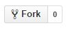
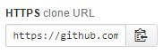
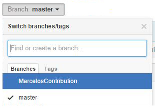
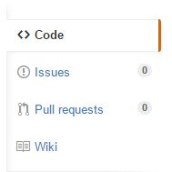
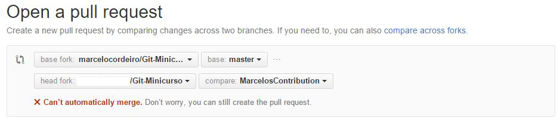
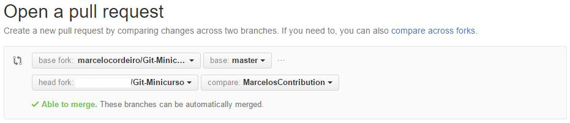

#Minicurso - Controle de Versão usando o Git

Bem vindos ao nosso minicurso de Git!

Os slides do minicurso estão disponíveis [aqui](Slides.pdf).

E também usaremos este repositório para completar o último exercício do nosso curso.

---

Neste exercício iremos simular como trabalhar em um projeto OpenSource. O primeiro passo, como discutimos no nosso curso, é dar um Fork no repositório onde o projeto está hospedado. O Fork irá copiar todo o projeto, incluindo a base de dados do Git (commits, branches, etc), para a sua conta do GitHub. Assim você poderá trabalhar com o projeto como se ele fosse seu, realizando quantos pulls e pushes você achar necessário.

Neste exercício, vocês irão me ajudar contribuindo com links (de preferência sobre Git) que vocês tenham achado interessantes. Portanto, após criarem sua conta no GitHub e estarem logados, cliquem em Fork (canto superior direito).



Agora o projeto está copiado, exatamente como ele estava, para um repositório na conta de vocês. O GitHub sabe que esse repositório é o Fork de outro projeto, mas para o Git na verdade isso não faz nenhuma diferença. O repositório "forkado" funciona exatamente como qualquer outro repositório que vocês tenham criado.

Agora vamos às contribuições! Entre no repositório na conta de vocês (é importante que seja o que foi copiado com o Fork, não o que está hospedado na minha conta). No final da coluna à direita do GitHub, terá o link para vocês realizarem o clone do repositório.



Clonem o repositório no computador de vocês e façam sua contribuição no arquivo [Links.md](Links.md). Reparem a extensão do arquivo, .md, reparem que também é esse a extensão deste README. 

Md é a extensão de arquivos Markdown, que é um formato para arquivos de textos mais elaborados, com imagens, links, etc. É o formato usado como padrão para documentação em Git, sua sintaxe é extremamente simples e fácil de aprender. E como vocês podem ver, o GitHub automaticamente já interpreta esse arquivo e o mostra formatado para vocês. Além disso, ao entrar no repositório ele automaticamente já abre o arquivo README.md, como se fosse a página de boas-vindas do seu repositório. 

Mas voltando às contribuições, para este exercício vocês não precisarão de nenhum conhecimento avançado sobre Markdown. Apenas sigam o formato das contribuições que já estiverem no arquivo.

Antes de editar o arquivo, é uma prática comum criar um branch novo que descreva mais a mudança que você quer fazer. Lembram o branch que criamos para resolver o Issue 53? A ideia aqui é a mesma, imagine que o projeto seja grande e você não quer bagunçar ele tentando adicionar sua contribuição, pois se não der certo você pode simplesmente apagar o branch e voltar para o master onde o projeto estará intacto. 

Portanto, criem um branch novo (neste exemplo, para simular uma contribuição feita por mim, eu o chamarei de _MarcelosContribution_, mas vocês podem chamá-lo como quiser), mudem para esse branch, editem o arquivo no seu computador, adicionem sua contribuição (ou contribuições), e então de um commit para o seu repositório. Nesse momento a sua contribuição está salva apenas no seu computador, o próximo passo é enviar ela para o seu repositório no GitHub.

Mas antes disso, lembram que eu falei que o repositório "forkado" não tem absolutamente nada de diferente que um repositório normal? Após o fork, o repositório que foi copiado para a sua conta e o da minha conta ficam independentes um do outro, ou seja, se eu alterar algo no meu repositório, não irá alterar nada no seu.

Suponha que, desde que você fez o fork e enquanto trabalhava na sua contribuição, eu já aceitei a contribuição de outras pessoas. Portanto, o meu repositório estará diferente do seu. Se quiser, você ainda pode ignorar essas mudanças e me enviar sua contribuição, mas isso muito provavelmente iria gerar um conflito quando eu for aceitá-la, afinal, o arquivo Links.md que você editou agora já é diferente do arquivo que eu tenho.

Pensando em projetos OpenSource de verdade, o seu objetivo é ajudar o dono do projeto, e não dá-lo ainda mais trabalho precisando resolver conflitos para conseguir incorporar suas mudanças ao projeto. Portanto, é extremamente importante que você antes atualize o seu repositório local para que ele fique sincronizado com o repositório do projeto original. Assim, se for para ocorrer algum conflito, você mesmo já o resolve antes de enviar sua contribuição.

Fazer isso é muito simples, lembram que eu disse durante o curso que o seu repositório no GitHub (ou em qualquer outro servidor de Git) é apenas um branch remoto no seu projeto? E então quando você faz um git fetch ou git pull, ele atualiza os ponteiros desse branch remoto, ou seja, ele sincroniza o seu repositório local com o seu repositório no GitHub.

E como eu também disse, branches remotos não são assim tão diferentes de branches normais, portanto também é possível ter vários branches remotos ligados ao nosso projeto. E é exatamente isso que queremos, adicionar o repositório da minha conta do GitHub como um branche remoto no projeto de vocês, assim vocês podem a qualquer momento sincronizar o diretório local de vocês com o meu diretório.

Fazemos isso com esse comando: 

```sh
git remote add upstream https://github.com/ltiaunesp/Git-Minicurso
```

O nome padrão para esse tipo de branch é _upstream_, mas se quiserem podem mudar o nome.

Agora vocês podem dar um pull no branch upstream, e ele irá automaticamente sincronizar o seu repositório com o meu. Se ocorrer algum conflito, você mesmo já o resolve.

```sh
git pull upstream master
```

Agora vocês já adicionaram sua contribuição e têm certeza que nossos repositórios estão sincronizados. O próximo passo é enviar tudo isso para o repositório da sua conta no GitHub (aquele que foi criado com o fork).

```sh
git push origin MarcelosContribution
```

Se tudo ocorrer com sucesso, o seu branch deverá aparecer na seu diretório do GitHub. Repare que nós enviamos um novo branch para o GitHub (ao invés do tradicional master), portanto é necessário mudar de branch para ver as mudanças no arquivo no Links.md.



Por fim o último passo é enviar sua contribuição de volta para o meu repositório.

Ao enviar um novo branch para o GitHub, ele automaticamente mostrará a opção para realizar um _Pull request_.


Se essa opção não aparecer, é só clicar nela no menu à direita.




Uma das muitas funções do Pull Request é mesclar (merge) branches que já estão GitHub, ou seja, através de um Pull Request seria possível dar um merge no nosso novo branch com o branch master, assim como faríamos pelo bash no nosso repositório local. Mas essa não é a sua principal função.

Lembram que eu disse que sempre que você fizer um push o GitHub irá pedir suas credenciais para verificar se você tem autorização para escrever naquele repositório? Portanto, como nenhum de vocês tem autorização para escrever no meu repositório, não vai funcionar se tentarem enviar sua contribuição com um push (podem tentar).

```sh
git push upstream MarcelosContribution
```

A solução para isso é cria um Pull Request. A lógica aqui é pensar que vocês na verdade não estão dando um push, e sim me pedindo para dar um pull. É como se vocês mostrassem sua contribuição para mim, e então eu decido se quero _puxar_ elas para o meu projeto ou não.

É importante lembrar aqui mais uma vez do risco de ocorrer um conflito. Afinal, se eu aceitar suas contribuições e resolver _dar um pull_, automaticamente também será feito um merge dessas mudanças com o meu projeto, o que pode resultar em conflitos. E então as chances da sua contribuição ser aceita caem drasticamente...

Portanto, é realmente muito importante ter aquele branch _upstream_ para sincronizar seu repositório com o projeto de origem antes de enviar o Pull Request.

Se você se esquecer disso e sua contribuição de fato for gerar algum conflito, na hora de criar o Pull Request o GitHub irá te avisar, e então você pode escolher cancelar o Pull Request e voltar para o bash resolver isso (recomendado), ou enviar o Pull Request mesmo assim (não recomendado).



Finalmente, após resolver os possíveis conflitos, agora vocês já podem me enviar sua contribuição! É só criar o Pull Request :D



Eu irei receber uma notificação no meu repositório me pedindo para analisar a contribuição de vocês. Depois que eu aceitá-la, ela automaticamente será adicionada ao meu projeto.

---

Espero que vocês tenham gostado do nosso curso e desse último exercício. Tentei fazer algo bem simples e focar mais em conceitos chaves, assim espero que vocês consigam expandir a ideia e contribuir de verdade com qualquer projeto no GitHub.

Qualquer dúvida ou sugestão que vocês tiverem, me enviem um e-mail (marcelo.augusto.cordeiro@gmail.com) ou me procurem no Facebook, ficarei feliz com o feedback de vocês ;)

Muito obrigado por terem participado do nosso curso! E fiquem de olho na página do LTIA no Facebook, em breve oferecemos mais cursos.

Abraços,

Marcelo Cordeiro

---